# Desafio Azure Language Studio
No presente documento será explicado o processo para utilizar o [Azure Language Studio](https://language.cognitive.azure.com) e realizar a Análise de Sentimento de opiniões para o projeto do módulo "Processamento de Linguagem Natural" do curso "Microsoft Azure AI Fundamentals" ministrado pela [DIO](https://web.dio.me). Para este exercício criei 5 avaliações de um restaurante fictício para serem analisadas pela IA desta plataforma e avaliadas como positivas, negativas ou neutras.

💡 Como minha conta no Microsoft Azure está em inglês, alguns termos e comandos serão apresentados neste idioma.

## Utilizando o Azure Language Studio
- Inicialmente, deve-se acessar a página do [Microsoft Azure](https://portal.azure.com) e fazer o login;
- Então clicar em "+Create a resource", selecionar "AI + Machine Learning" e, dentre as opções, escolher "Language service";
- Clicar em "Continue to create a resource", selecionar o "Resource group", dar um nome compatível ao projeto, escolher a opção "Free F0" em "Pricing tier", e selecionar a caixinha sobre o serviço;
- Clicar em "Review + Create", aguardar a validação, e então "Create";
- Após a conclusão da criação, ir ao portal do Azure Language Studio e realizar o Sign In;
- Uma janela será aberta, "Select an Azure Resource", onde deve-se selecionar o tipo de subscription que se possui e a resource que foi criada, e então clicar em "Done";
- Na página inicial do Azure Language Studio, ir para a aba "Classify text" e escolher a primeira opção "Analyse sentiment and mine opinions";
- Selecionar o idioma do texto a ser analisado, no caso deste projeto "Portuguese (Brazil)";
- Na caixa de texto abaixo pode-se escrever o texto a ser analisado ou abrir um arquivo de texto, no caso eu recortei cada uma das opiniões para serem analisadas separadamente;
- Após inserir o texto, selecionar a caixinha sobre o serviço e clicar em "Run";
- É apresentado um resultado do texto geral e de cada uma das frases do texto, destacando as palavras-chaves que levaram a esses resultados.

## Resultados
### Avaliação #1
- Este é o resultado do texto da primeira avaliação como um todo:

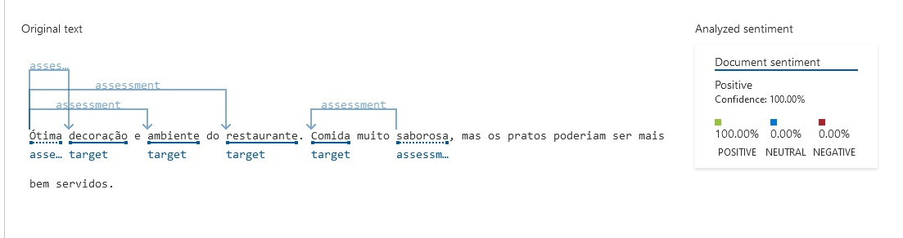

- Estes são os resultados das análises de cada frase:

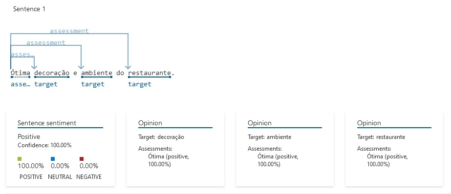
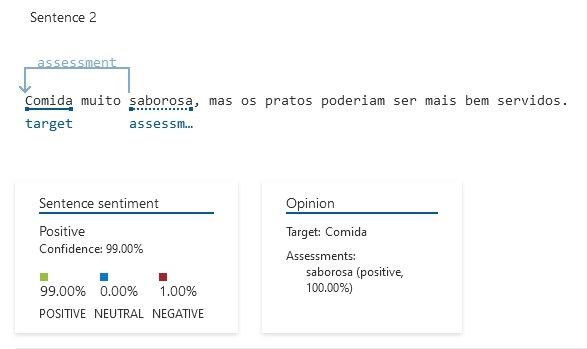

### Avaliação #2
- Este é o resultado do texto da segunda avaliação como um todo:

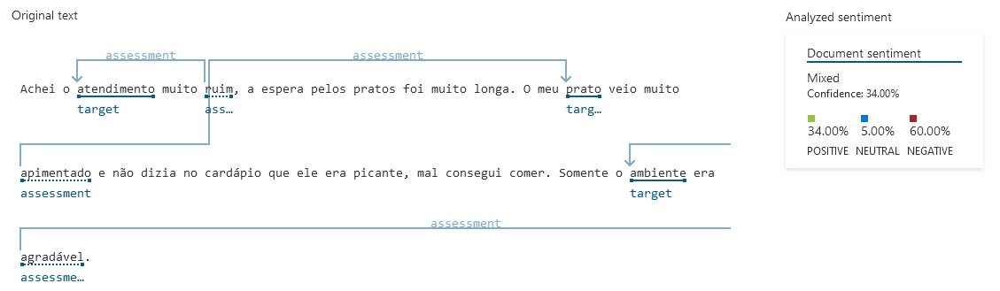

- Estes são os resultados das análises de cada frase:

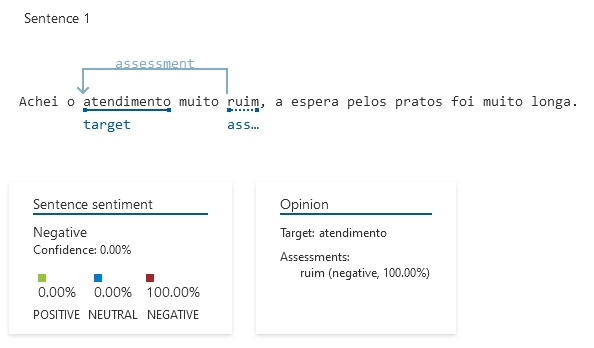
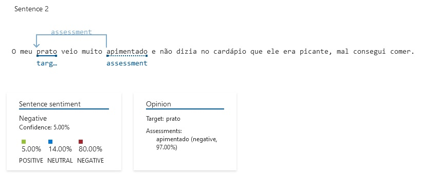
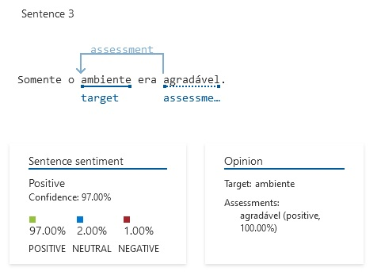

### Avaliação #3
- Este é o resultado do texto da terceira avaliação como um todo:

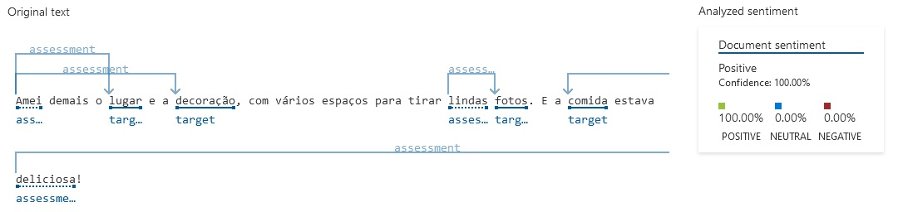

- Estes são os resultados das análises de cada frase:

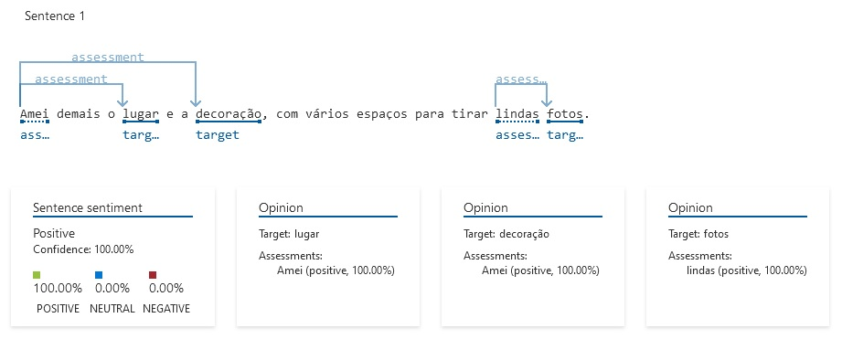
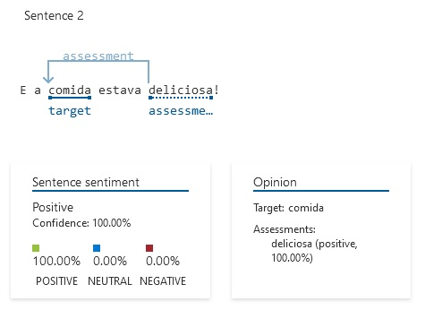

### Avaliação #4
- Este é o resultado do texto da quarta avaliação como um todo:

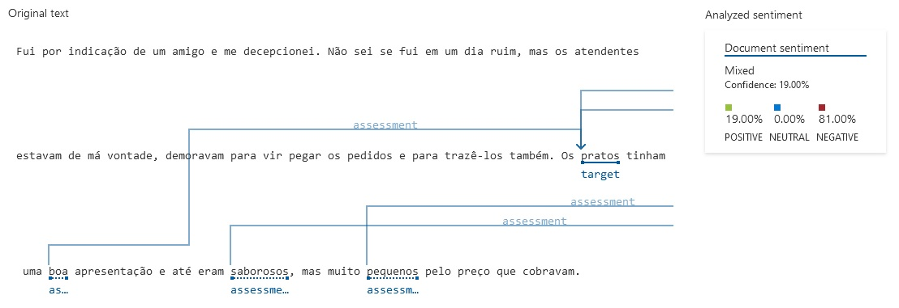

- Estes são os resultados das análises de cada frase:

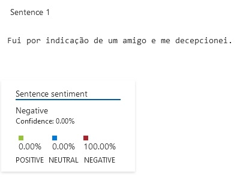
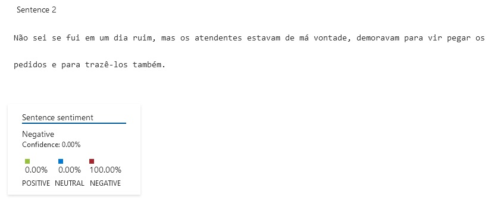
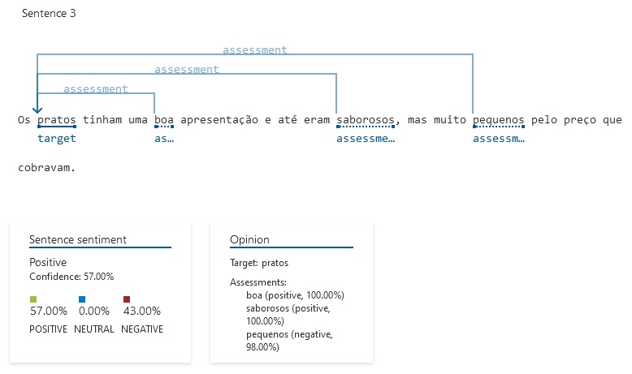

### Avaliação #5
- Este é o resultado do texto da quinta avaliação como um todo:

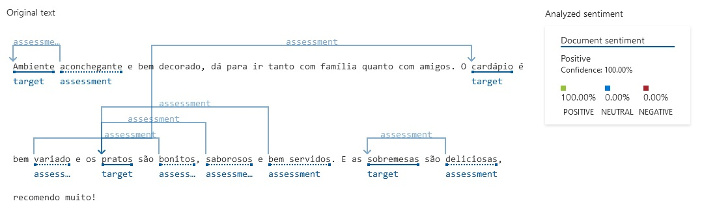

- Estes são os resultados das análises de cada frase:

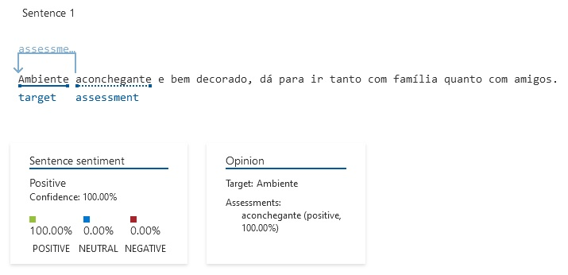
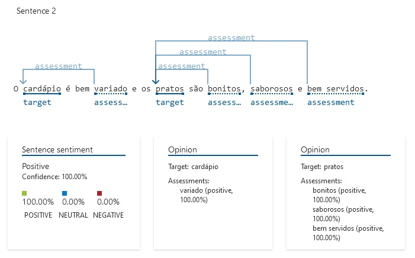
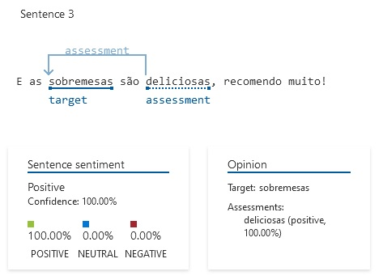

## Analisando os resultados
Pode-se perceber com os resultados gerados neste projeto que a IA do Azure Language Studio é capaz de fazer análise de sentimentos, mas de construções gramaticais mais simples, com substantivo e adjetivos bem definidos. A IA demonstrou ter dificuldade em realizar a análise de expressões adjetivas e construções gramaticais mais complexas, com utilização de orações subordinadas. Em frases sem substantivo e adjetivo mais definidos, a IA conseguiu até interpretar o sentimento, mas não apontou quais os parâmetros utilizados. Com este projeto, compreende-se que a IA já possui um bom banco de dados para buscar suas interpretações mas que ainda pode ser aprimorado, adicionando mais conceitos e nuances da língua falada/coloquial.

## 💻Programas Utilizados
  